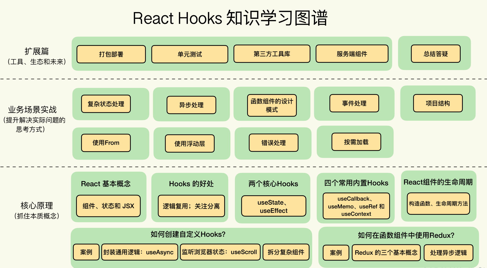

# [reacthooks4fun](https://shonesinglone.github.io/reacthooks4fun/)

# NOTE



Hooks 带来的最大好处：逻辑复用

## 内置useState、useEffect、useCallback、useMemo、useRef、useContext

## useEffect

- 每次 render 后执行：不提供第二个依赖项参数。比如
useEffect(() => {})。
- 仅第一次 render 后执行：提供一个空数组作为依赖项。比如
useEffect(() => {}, [])。//onece
- 第一次以及依赖项发生变化后执行：提供依赖项数组。比如
useEffect(() => {}, [deps])。//watch
- 组件 unmount 后执行：返回一个回调函数。比如
useEffect() => { return () => {} }, [])。

依赖项中定义的变量一定是会在回调函数中用到的，否则声明依赖项其实是没有意义的。
依赖项一般是一个常量数组，而不是一个变量。因为一般在创建 callback 的时候，你其实非常清楚其中要用到哪些依赖项了。
React 会使用浅比较来对比依赖项是否发生了变化，所以要特别注意数组或者对象类型。如果你是每次创建一个新对象，即使和之前的值是等价的，也会被认为是依赖项发生了变化。这是一个刚开始使用 Hooks 时很容易导致 Bug 的地方。例如下面的代码：

## Hooks使用原则

- Hooks 要在顶层作用域中使用
- Hooks一定要被执行到
- Hooks一定是按顺序执行

## useCallback 缓存回调函数

`useCallback(fn, deps)`

## useMemo 缓存计算结果（computed）

`useMemo(fn, deps)`
可以用useMemo 实现 useCallback
useMemo return fn

## useRef 单独保存数据的引用（DOM）

```jsx
function TextInputWithFocusButton() {
  const inputEl = useRef(null);
  const onButtonClick = () => {
    // current 属性指向了真实的 input 这个 DOM 节点，从而可以调用 focus 方法
    inputEl.current.focus();
  };
  return (
    <>
      <input ref={inputEl} type="text" />
      <button onClick={onButtonClick}>Focus the input</button>
    </>
  );
}
```

## xItem

## datagrid
